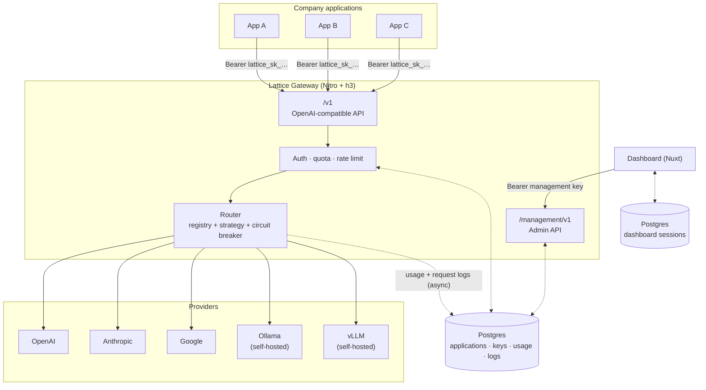
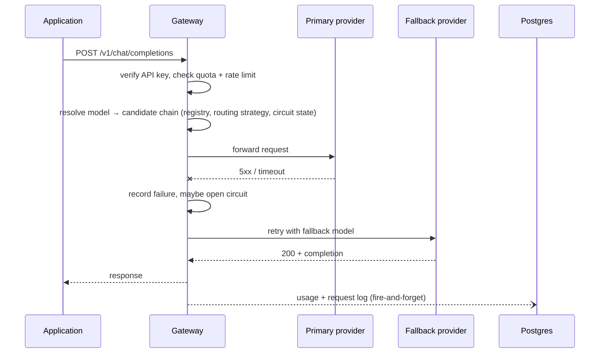
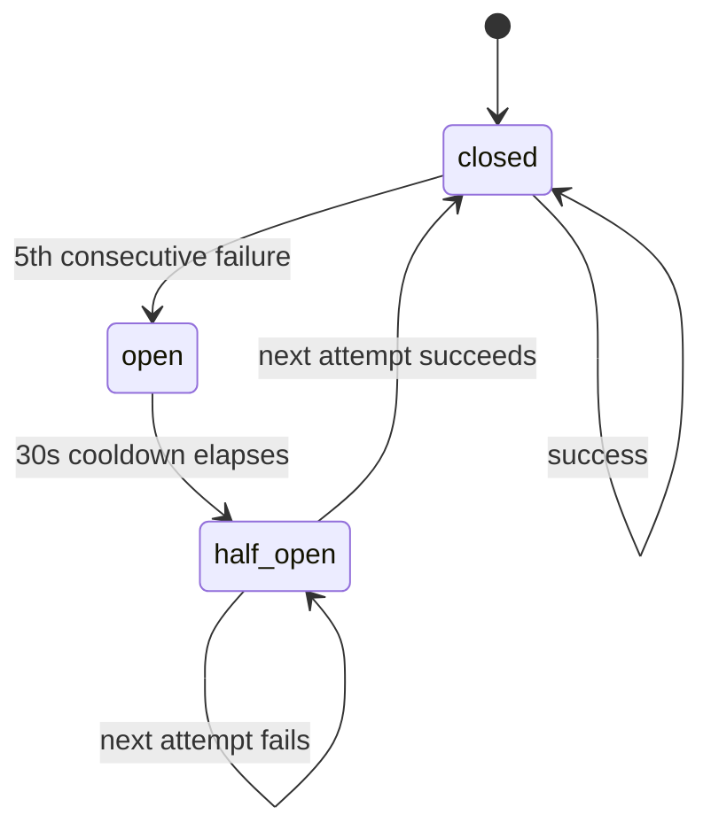
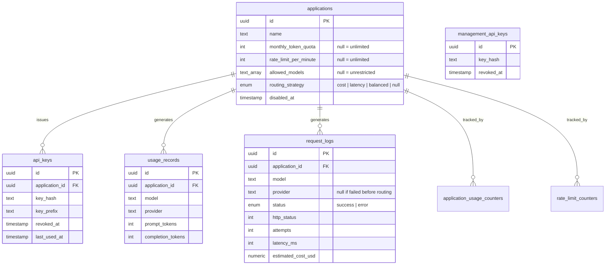

# Lattice

> Centralized AI infrastructure for connecting applications to cloud and self-hosted models.

Lattice is an internal AI gateway. Company applications talk to one OpenAI-compatible API instead of juggling separate credentials, SDKs, and failure modes for OpenAI, Anthropic, Google, Ollama, and vLLM. The gateway holds the provider credentials, decides which provider handles a request, retries against a fallback when one fails, and records what happened.

```text
Application A ─┐
Application B ─┼──▶ Lattice ──▶ OpenAI / Anthropic / Google / Ollama / vLLM
Application C ─┘
```

Each application authenticates with a single Lattice API key and calls stable model names like `gpt-4o` or `claude-sonnet`. Which provider actually serves that name, and what it falls back to when that provider is down, is a gateway-side decision, not something every client needs to know.

## Architecture

Lattice is a two-app monorepo: the **gateway** is the thing applications and providers actually talk to, and the **dashboard** is an admin surface built on top of the gateway's own management API.



Provider credentials live only in the gateway's environment. Applications never see them, and the dashboard reaches the gateway the same way an application would: over the network, with a bearer key, just against `/management/v1` instead of `/v1`.

## Request lifecycle

A chat completion is authenticated, checked against quota, routed to a candidate provider chain, and logged, without any of that bookkeeping blocking the response the client sees.



Only 5xx, timeout, and connection failures trigger a fallback attempt. A 4xx from the provider means the request itself was bad, and retrying it against a different provider wouldn't fix that. For streaming requests, failover can only happen before the first chunk reaches the client: the gateway pulls one chunk from each candidate before committing to it, so a client never sees a failed attempt's partial output.

## Failover and circuit breaking

Each provider has its own in-memory circuit, per gateway process. Five consecutive failures opens it; a request against an open provider is skipped in favor of the next candidate so a known-down provider doesn't eat a full timeout on every request.



If every candidate for a model is open at once, the gateway tries the original order anyway rather than failing the request on its own bookkeeping. A stuck circuit should never be worse than no circuit at all.

## Model registry and routing

Models are declared once, centrally, in `apps/gateway/server/registry/models.config.ts`:

```ts
{
  id: 'gpt-4o',
  provider: 'openai',
  providerModel: 'gpt-4o',
  fallbacks: ['claude-sonnet', 'gemini-pro'],
  pricing: { inputPerMillionUsd: 2.5, outputPerMillionUsd: 10 },
}
```

Each entry can carry `aliases` (extra names a client may request, e.g. `company/smart`), an ordered `fallbacks` chain, and static `pricing` used only for cost-aware ranking. The registry is validated at boot: duplicate ids, colliding aliases, self-referential fallbacks, and models pointing at an unconfigured provider all crash startup instead of a request.

An application can pin a `routingStrategy` (set through the management API):

| Strategy        | Candidate order                                          |
| --------------- | -------------------------------------------------------- |
| unset (default) | the registry's declared `[primary, ...fallbacks]` order  |
| `cost`          | ascending blended `$/M` input+output price               |
| `latency`       | ascending rolling average latency, per model             |
| `balanced`      | cost and latency, min-max normalized and averaged evenly |

A candidate with no price or no latency sample yet still gets tried; it just sorts after every candidate that has a score.

## Application policies

Every application row in Postgres doubles as its own policy:

- `allowedModels`: `null` means unrestricted; otherwise an allowlist checked against the raw model name before alias resolution.
- `monthlyTokenQuota`: `null` means unlimited; otherwise requests are rejected once the month's token counter reaches it.
- `rateLimitPerMinute`: `null` means unlimited; otherwise a fixed 60-second window counter enforces it.
- `routingStrategy`: overrides the registry's declared order as described above.
- `disabledAt`: set it, and every one of the application's API keys stops working immediately without revoking them one by one.

## Providers

```text
server/providers/
├── openai/               cloud, OpenAI's native API
├── anthropic/            cloud, Anthropic's native API
├── google/               cloud, Gemini's native API
└── openai-compatible/    shared adapter (request/response/SSE translation)
    ├── ollama/           self-hosted, talks OpenAI-compatible endpoints
    └── vllm/             self-hosted, talks OpenAI-compatible endpoints
```

Ollama and vLLM are both thin configurations of the same `openai-compatible` adapter pointed at a different `baseUrl`, since both already speak an OpenAI-shaped `/v1/chat/completions`. A self-hosted provider is "configured" once it has a `baseUrl`; unlike the cloud providers, it may run with no API key at all.

## Management API and dashboard

Everything under `/management/v1/**` is authenticated with a separate management API key, distinct from the per-application keys `/v1/**` accepts, and not scoped to any one application, since it administers the gateway itself.

| Resource     | Endpoints                                        |
| ------------ | ------------------------------------------------ |
| Applications | list, create, get, update, per-application usage |
| API keys     | list, create, revoke (scoped to an application)  |
| Requests     | paginated request log                            |
| Usage        | aggregate usage summary                          |
| Providers    | live circuit state per provider                  |
| Models       | the resolved registry, as served to clients      |

The dashboard (`apps/dashboard`, Nuxt 4 + Nuxt UI) is a thin admin client over that API: an overview of request volume, token spend, and provider health; application and API key management; a provider health board; a request log browser. Its server routes proxy to the gateway with `gatewayFetch`, which holds the management key server-side and never lets it reach the browser. Dashboard sign-in is separate from all of this. It's better-auth session auth for admins, backed by its own Postgres database (which can be the same Postgres server as the gateway's, or a different one entirely).

## Data model



`request_logs` is append-only observability history, written best-effort so a logging failure never affects the client response. `application_usage_counters` and `rate_limit_counters` are running totals kept separately so a quota or rate-limit check is a single row read, not a scan over `usage_records`. `management_api_keys` has no foreign key to `applications`; it authorizes the gateway's own admin surface, not any one application's traffic.

## Security

Applications and the dashboard both authenticate with a bearer key; the gateway never re-exposes a provider credential to either.

```text
Application ──[lattice_sk_… key]──▶ Gateway ──[provider credential]──▶ Provider
Dashboard   ──[management key]───▶ Gateway
```

API keys are generated with 32 bytes of randomness, prefixed `lattice_sk_`, and stored as an HMAC-SHA256 hash of the key under a server-side pepper, never the raw key. Losing the pepper invalidates every issued key at once, which is the intended failure mode: it means a stolen database dump alone can't be turned back into usable keys.

## Repository structure

```text
lattice/
├── apps/
│   ├── gateway/            Nitro + h3, the AI gateway itself
│   │   └── server/
│   │       ├── routes/v1/           OpenAI-compatible API
│   │       ├── routes/management/   admin API
│   │       ├── providers/           per-provider adapters
│   │       ├── registry/            model registry + credentials
│   │       ├── routing/             dispatch, scoring, circuit breaker
│   │       ├── auth/                API key hashing + verification
│   │       ├── middleware/          auth, rate limit, request id
│   │       └── database/            Drizzle schema + repositories
│   └── dashboard/          Nuxt 4 + Nuxt UI, admin dashboard
│
├── packages/
│   ├── api-contract/       shared Valibot schemas + inferred types
│   └── env/                typed, validated environment parsing
│
└── tests/                  mirrors apps/ and packages/ by path
```

## Development

Requires Bun 1.4+ and Node ^26 (`devEngines`/`engines` in `package.json`).

```bash
bun install
```

Each app needs its own `.env` (see `apps/gateway/.env.example` and `apps/dashboard/.env.example`) and a Postgres database. From `apps/gateway`:

```bash
bun run generate-pepper        # API_KEY_PEPPER for .env
bun run db:migrate
bun run seed-management-key admin   # mints a key for the dashboard's LATTICE_MANAGEMENT_API_KEY
bun run dev                    # nitro dev, defaults to :3001
```

From `apps/dashboard`:

```bash
bun run db:migrate
bun run dev                    # nuxt dev, defaults to :3000
```

### Commands

| Command                           | Purpose                            |
| --------------------------------- | ---------------------------------- |
| `bun run check`                   | format + lint (run before pushing) |
| `bun run test`                    | vitest, repo-wide                  |
| `bun run typecheck`               | typecheck every workspace          |
| `bun --filter gateway <script>`   | run a script in `apps/gateway`     |
| `bun --filter dashboard <script>` | run a script in `apps/dashboard`   |

## Status

Lattice has shipped through its planned phases: an OpenAI-compatible API with streaming and basic failover, then self-hosted providers, model aliases, usage and rate-limit accounting, then cost- and latency-aware routing, the management API, and the dashboard. It's an internal platform under active development, and the API, provider set, and routing behavior will keep changing as real usage surfaces new requirements.

<details>

<summary>Phase history</summary>

**Phase 1**: OpenAI-compatible API, application auth, model registry, OpenAI/Anthropic/Google providers, streaming, basic routing and failover.

**Phase 2**: Ollama and vLLM support, model aliases, usage tracking, token accounting, rate limiting, application quotas, provider health monitoring.

**Phase 3**: Cost- and latency-aware routing, advanced provider fallback, management API, dashboard, API key management, advanced observability, policy management.

</details>
